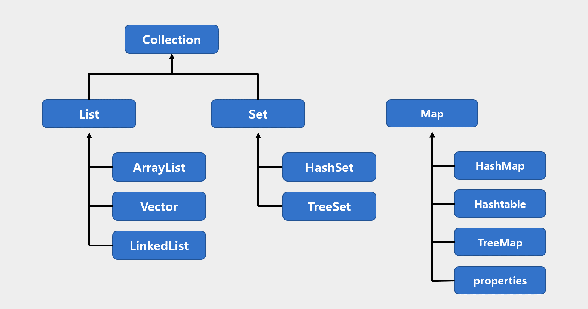

## [ 컬렉션 프레임워크의 핵심 인터페이스 ]
### List, Set은 공통부분이 많아 Collections 인터페이스로 묶어내줄 수 있었다.

- 참고). JDK 1.5부터 Iterable 인터페이스가 추가되어 Collection 인터페이스가 이를 상속받지만, iterator() 를 뽑아서 중복을 제거하기 위한 것에 불과하다.
- Vector, Stack, Hashtable, Properties 클래스들은 컬렉션 프레임워크가 만들어지기 전부터 존재하던 것이다. 

### Collection 인터페이스
- add(), addAll(), clear()
- contains(), containsAll()
- equals()
- hashCode()
- isEmpty()
- iterator()
- remove(), removeAll()
- retainAll()
- size()
- toArray()

### List 인터페이스
- add(), addAll()  // 지정된 위치에 객체 또는 컬렉션에  포함된 객체들을 추가.
- get()
- indexOf(), lastIndexOf()
- listIterator()
- remove()
- set()  // 지정된 위치에 객체를 저장한다.
- sort()
- subList(int fromIndex, int toIndex)  // 지정된 범위에 있는 객체를 반환.

## [ 컬렉션 프레임워크의 구성 요소 ]
### ArrayList
컬렉션 프레임워크에서 가장 많이 사용되는 컬렉션 클래스. 저장순서 유지, 중복을 허용한다는 특징을 갖는다.      
기존의 Vector를 개선한 것으로 Vector와 구현원리와 기능적인 측면이 동일하다.

메서드
- ArrayList(), ArrayList(Collection c), ArrayList(int initialCapacity)
- add(), addAll()
- clear()
- clone()
- contains()
- get(), indexOf()
- isEmpty()
- iterator()     
- ...

### 다음은 ArrayList 를 활용한 예제 코드를 연습한 내용이다.
[예제코드 - ArrayListEx1](javajungsuk/collectionsFramework/ArrayListEx1.java)

Q. 주어진 문자열을 10개씩 잘라서 ArrayList에 저장하세요.    
답안). [예제코드 - ArrayListEx2]()

### ArrayList, Vector 의 장,단점
- 장점
  - 데이터 읽기, 맨 뒤에 저장/삭제하기
- 단점
  - 용량 변경 시 새로 생성된 배열로 데이터를 복사하는 과정에서 효율이 떨어진다.
### 배열의 단점
- 크기를 변경할 수 없다.
  - 크기를 변경하고 싶으면, 새로운 배열 생성해서 데이터를 복사해야 한다.
  - 충분히 큰 크기의 배열을 생성해야 하므로, 메모리가 낭비된다.
- 중간에 데이터를 삽입, 삭제하는데 시간이 많이 걸린다.
  - 중간 삽입은 빈자리를 만들기 위해 다른 데이터들을 복사해서 이동해야 한다.
  - 중간 삭제는 빈자리를 채우기 위해 다른 데이터들을 복사해서 이동해야 한다. 

 

### LinkedList 
> 배열의 단점을 보완하기 위해 등장한 자료구조이다.     
> 물리적으로는 불연속적이지만, 노드가 다음 노드를 가리키는 방식으로 구성되어 논리적인 연결성을 가진다.
### LinkedList 는 삽입/삭제에 매우 효율적이다. 
- 삭제하고자 하는 요소의 이전요소가 삭제하고자 하는 요소의 다음 요소를 참조하도록 변경하면 끝이다. 
  - 배열처럼 데이터 이동하는 과정이 없기 때문에 삽입/삭제에서 처리 속도가 매우 빠르다. 
### Doubly LinkedList
> 링크드 리스트는 이동방향이 단방향이다. 따라서 이전요소에 대한 접근이 쉽지 않았다.     
> 이중 연결리스트는 이전 요소의 주소를 추가함으로써, 모든 요소에 대한 접근과 이동을 쉽게 만든 자료구조이다. 
### Doubly Circular LinkedList
> 이중 연결리스트에서 첫 번째 요소와 마지막 요소를 서로 연결시킨 자료구조이다. 마지막 요소의 다음요소가 첫 번째 요소가 된다.