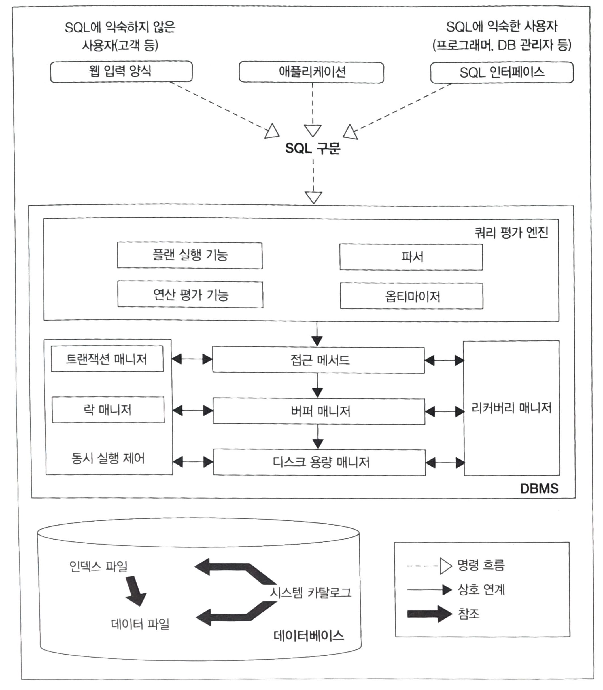

## [ DBMS 아키텍처 개요 ]
- - -

SQL 구문은 DBMS를 통해 다양한 처리를 수행한다.   

### DBMS 내부에는 어떤 기능들이 있을까 ?
1. 쿼리 평가 엔진   
   - SQL 구문 분석 후, 어떤 순서로 기억장치의 데이터에 접근할지를 결정한다.(실행 계획)   

2. 버퍼 매니저   
    - 메모리는 가장 빠른 1차 기억 장치이며, 자주 접근하는 데이터를 메모리 위에 올려둠으로써 성능 향상을 가져올 수 있다.
    - 고속 접근이 가능한 버퍼에 '데이터를 어떻게, 어느 정도의 기간 동안 올릴지'를 관리한다.

3. 디스크 용량 매니저   
   - 어디에 어떻게 데이터를 저장할지를 관리한다.(데이터의 읽고 쓰기를 제어한다.)

4. 트랜잭션 매니저와 락 매니저   
   - 데이터베이스에 대해 동시에 발생하는 수 많은 트래픽 요청에 대해 각각의 트랜잭션 단위로 관리하고, 필요한 경우 데이터에 락을 걸어 다른 사람의 요청을 대기시키는 역할을 수행한다.
5. 리커버리 매니저
   - 데이터를 정기적으로 백업하고, 문제 발생 시 복구해주는 기능을 수행한다. 

## [ DBMS와 버퍼 ]
- - -
### 메모리 위의 두 개의 버퍼
데이터 캐시
- 디스크에 있는 데이터 일부를 메모리에 유지하기 위해 사용하는 메모리 영역이다.   
    디스크와 같은 저속 저장소에 접근하지 않고 처리가 수행되기 때문에, 속도가 굉장히 빠르다.   

로그 버퍼
-  SQL 구문을 받으면, 일단 로그 버퍼 위에 변경 정보를 보내고 이후 디스크에 변경을 수행한다.
-  이렇게 하는 이유는, '저장소의 느림을 어떻게 보완할 것인가'라는 것을 계속해서 고민해온 미들웨어가 DBMS 이기 때문이다.   
즉, 저장소에 갱신 처리를 보내고 변경이 끝날 때까지 기다리면 시간이 너무 오래 지연될 수 있다. 이에 SQL 구문의 실행과 저장소에 실제로 갱신하는 시점을 **비동기**로 가져가는 것이다.
-  데이터베이스는 기본적으로 **갱신보다는 검색을 메인으로 처리한다고 가정**하기 때문에, 데이터 캐시에 비해 용량이 매우 작다. (실제로 1MB도 되지 않는다.)

### 메모리 휘발성의 문제점과 해결
로그 버퍼 위에 존재하는 데이터에 장애가 발생해서 사라지면, 데이터 정합성에 큰 문제가 발생한다.(SQL 구문 실행과는 비동기로 작동하기 때문에, 시점 차이로 인한 정합성 문제 발생 가능함)   
이러한 DBMS의 갱신이 비동기라는 특징을 보완하기 위해서 등장한 것이 바로 '커밋(commit)'이다.
- 커밋 시점에는 반드시 갱신 정보를 로그 파일에 씀으로써, 정합성을 유지한다.   
- 커밋 시점에는 '동기 접근'이 일어나는 것인데, 결국 여기서 또 지연이 발생할 수 있다.(데이터 정합성은 높아지지만, 성능은 낮아진다.)    

**이처럼 데이터 정합성과 성능은 서로 트레이드 오프 관계에 있다.**

### 추가적인 메모리 영역 '워킹 메모리'
DBMS는 정렬 또는 해시 관련 처리에 사용되는 작업용 영역인 '워킹 메모리'를 추가적으로 가지고 있다.   
MySQL에서는 '정렬 버퍼', sort_buffer_size 라는 이름을 갖고 있다.
- 워킹 메모리가 부족하다면, DBMS는 저장소의 임시 영역에 접근하기 때문에, 성능적으로 매우 중요하다.   
  (OS 동작에서 말하는 스왑(swap)과 같은 것이다.)

   
